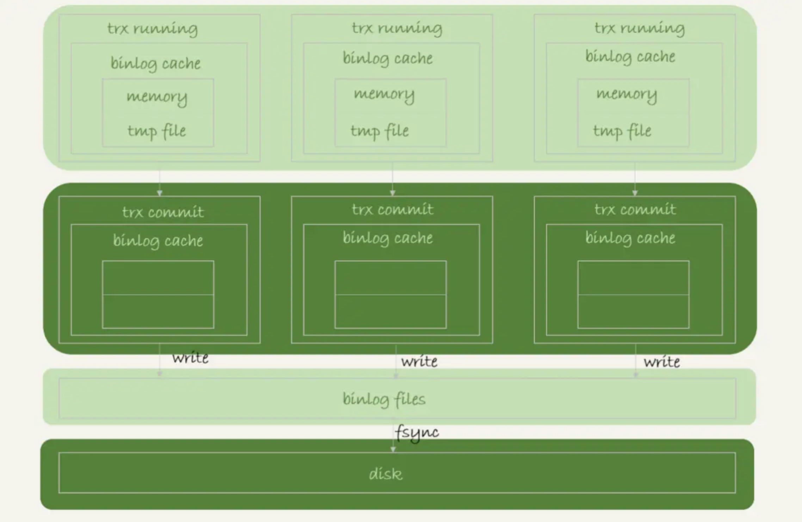

## Mysql日志文件
Mysql 中有以下几种重要的日志模块，分别是：

- redo log 
- bin log
- undo log

## redo log
### redo log是什么？
Mysql 每一次的更新操作如果都要从磁盘读取数据，并且将每次的更新操作都写入磁盘的话，整个过程的IO成本、查找成本都很高。所以，为了解决这个问题，引入了 WAL 技术（Write-Ahead Logging），它的关键点就是先写日志（redo log），再写磁盘。

具体来说，当有一条记录需要更新的时候，InnoDB引擎就会把记录写到redo log buffer，后续某个时间点再一次性将多个操作记录写到 redo log file 中（这个由参数 'innodb_flush_log_at_trx_commit' 控制），并更新内存，这个时候更新就算执行完成了。同时，InnoDB引擎会在适当的时候，将这个操作更新到磁盘里面，而这个更新往往是在系统比较空闲的时候做。

此外 redo log 还有确保事务的持久性的作用，如果发生故障的时间点，尚有脏页未写入磁盘导致数据丢失问题。在重启Mysql服务的时候，会根据redo log进行重做，恢复奔溃时暂未写入磁盘的数据，从而达到事务的持久性这一特性。

redo log 是 InnoDB 引擎特有的；是物理日志，记录的是“在某个数据页上做了什么修改”；redo log 是循环写的，空间固定会用完。

### redo log 工作原理
InnoDB 的 redo log 是固定大小的，比如可以配置为一组4个文件，每个文件的大小是1GB。从头开始写，写到末尾就又回到开头循环写，如下图所示：

write pos 是当前记录的位置，一边写一边后移，写到第 3 号文件末尾后就回到 0 号文件开头。check point 是当前要擦除的位置，也是往后推移并且循环的，擦除记录前要把记录更新到数据文件。write pos 和 check point 之间是还空着的部分，可以用来记录新的操作。如果 write pos 追上 check point，表示redo log满了，这时候不能再执行新的更新，得停下来先擦掉一些记录，把 check point 推进一下。有了 redo log，InnoDB 就可以保证即使数据库发生异常重启，之前提交的记录都不会丢失，这个能力称为 crash-safe。

### innodb_flush_log_at_trx_commit
innodb_flush_log_at_trx_commit 控制 redo log buffer 写入 redo log file 的时机，其参数值含义如下：

| 参数值 | 含义 |
| --- | --- |
| 0 | 事务提交时不会将 redo log buffer 中日志写入到 os buffer ，而是每秒写入 os buffer 并调用 fsync() 写入到 redo log file 中。也就是说设置为0时是(大约)每秒刷新写入到磁盘中的，当系统崩溃，会丢失1秒钟的数据。 |
| 1 | 事务每次提交都会将 redo log buffer 中的日志写入 os buffer 并调用 fsync() 刷到 redo log file 中。这种方式即使系统崩溃也不会丢失任何数据，但是因为每次提交都写入磁盘，IO的性能较差。 |
| 2 | 每次提交都仅写入到 os buffer ，然后是每秒调用 fsync() 将 os buffer 中的日志写入到 redo log file 。 |

实际上，除了后台线程每秒一次的轮询操作外，还有两种场景会让一个没有提交的事务的 redo log 写入到磁盘中。

1. 一种是，redo log buffer 占用的空间即将达到 innodb_log_buffer_size 一半的时候，后台线程会主动写盘。注意，由于这个事务并没有提交，所以这个写盘动作只是 write，而没有调用 fsync，也就是只留在了文件系统的 os buffer。
2. 另一种是，并行的事务提交的时候，顺带将这个事务的 redo log buffer 持久化到磁盘。假设一个事务 A 执行到一半，已经写了一些 redo log 到 buffer 中，这时候有另外一个线程的事务 B 提交，如果 innodb_flush_log_at_trx_commit 设置的是 1，那么按照这个参数的逻辑，事务 B 要把 redo log buffer 里的日志全部持久化到磁盘。这时候，就会带上事务 A 在 redo log buffer 里的日志一起持久化到磁盘。

### 物理文件
默认情况下，对应的物理文件位于数据库的 data 目录下的ib_logfile1、ib_logfile2。

相关参数如下：

- innodb_log_files_in_group – 指定文件个数（默认2）
- innodb_log_file_size – 指定文件大小
- innodb_mirrored_log_groups – 指定日志文件副本个数，主要用于保护数据（默认1）

## bin log
### bin log是什么？
bin log是Mysql Server层的逻辑日志，bin log中存储的内容称之为事件，每一个数据库更新操作（Insert、Update、Delete，不包含Select）等都对应一个时间（event）。简单的说 bin log 中存储的是更新数据库的SQL语句，但又不完全是SQL语句这么简单，bin log 中同时包含了用户执行的SQL语句（增删改）的反向SQL语句。

比如：delete 操作在 binlog 会有 delete本身和其反向的 insert 这两条记录；update 则同时存储着update执行前后的版本的信息；insert则对应着delete和insert本身的信息。

因此可以基于 binlog 做到类似于 oracle 的闪回功能，其实都是依赖于 binlog 中的日志记录。

### 工作原理
系统会给binlog cache分配了一片内存，每个线程一个，参数binlog_cache_size用于控制单个线程内binlog cache所占内存的大小。如果超过了这个参数规定的大小，就要暂存到磁盘。事务提交的时候，执行器把binlog cache里的完整事务写入到binlog 中，并清空 binlog cache。

- 图中的 write，指的就是指把日志写入到文件系统的 page cache，并没有把数据持久化到磁盘，所以速度比较快。
- 图中的 fsync，才是将数据持久化到磁盘的操作。一般情况下，我们认为 fsync 才占磁盘的 IOPS。

**write 和 fsync 的时机，是由参数 sync_binlog 控制的：**
1. sync_binlog=0 的时候，表示每次提交事务都只 write，不 fsync；
2. sync_binlog=1 的时候，表示每次提交事务都会执行 fsync；
3. sync_binlog=N(N>1) 的时候，表示每次提交事务都 write，但累积 N 个事务后才 fsync。

因此，在出现 IO 瓶颈的场景里，将 sync_binlog 设置成一个比较大的值，可以提升性能。在实际的业务场景中，考虑到丢失日志量的可控性，一般不建议将这个参数设成 0，比较常见的是将其设置为 100~1000 中的某个数值。但是，将 sync_binlog 设置为 N，对应的风险是：如果主机发生异常重启，会丢失最近 N 个事务的 binlog 日志。

### 物理文件
binlog 文件存放路径由参数 log_bin_basename 控制，binlog 日志文件按照指定大小，当日志文件达到指定的最大的大小之后，进行滚动更新生成新的日志文件（如：binlog.0001,binlog.0002）。

*对于每个 binlog 文件，会通过一个统一的 index（目录）文件来组织。*

- expire_logs_days - bin log 文件存放时间，默认为0，即不自动移除。
- log_bin_basename – bin log 文件存放路径
- max_binlog_size – 单个 bin log 文件最大大小（默认 1G）

## bin log 与 redo log 区别
**作用层面**
- bin log 是 Mysql Server 层的日志
- redo log 是 InnoDB 引擎层的日志

**存储内容**
- bin log 是逻辑日志，存储了执行了那个更新语句，以及这个更新语句的回滚语句。
- redo log 是物理日志，存储了在某个数据页上面做了什么修改。

**日志覆盖方式**
- bin log 单文件是有最大限制的，达到最大上限后会滚动的更新，但整体大小无限制。
- redo log 空间是固定的，只能循环写。

## 参考
- https://time.geekbang.org/column/article/68633
- https://www.lixueduan.com/post/mysql/07-binlog-redolog-undolog/
- https://segmentfault.com/a/1190000023827696